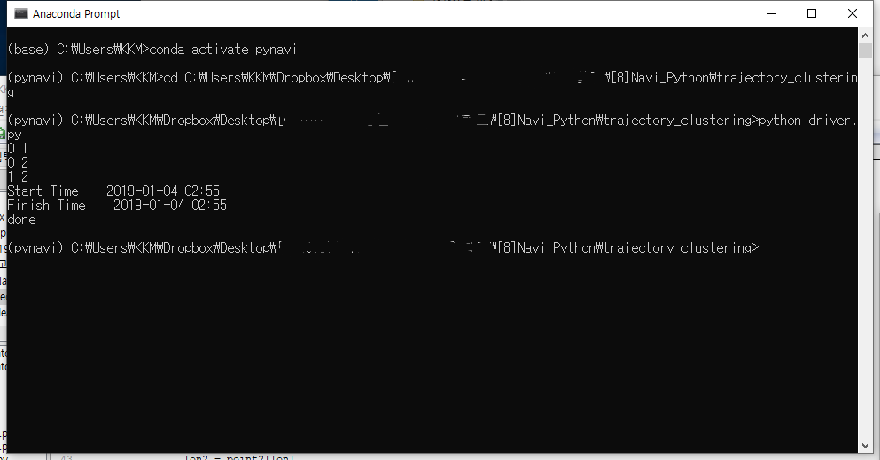

# PyNavi
#### A GPX trajectory combination algorithm 2 (Python)  
  
### Description  
This program is an implementation of the following paper:
> A Combination Method of Trajectory Data using Correlated Direction of Collected GPS Data
> [https://doi.org/10.9717/kmms.2016.19.8.1636](https://doi.org/10.9717/kmms.2016.19.8.1636)  

In short, this algorithm combines trajectory data, which is GPX(GPS Xml format) file,
and generates new routes like below:  
&nbsp;  

  

  
&nbsp;  

### Prerequisite  
- Python (ver. 2.7.11)  
- MongoDB  
- The test is carried out on Windows  
  
### Usage  
**Trajectory Clustering**  
In _/trajectory_clustering/driver.py_, the _input_ value is the directory for trajectories to combine. 
If _input_ is "C:\trajectories", the input GPX files should be in there.  
  
**Run driver.py**  
When you have files in _input_ and run _driver.py_, you can see like:  
&nbsp;  

  

  
&nbsp;  

**Check Database**  
After that, you can check out the information for combining trajectories:  
&nbsp;  

  

  
&nbsp;  

**Trajectory Direction**  
In _/trajectory_direction/driver.py_, the _output_ value is the directory for the generated routes. 
If _output_ is "C:\output", you can find the combined output after running _driver.py_ like:  
&nbsp;  

  

  
&nbsp;  

### Result  
**Input Path**  
The following shows 3 of input trajectories:  
  
  
  
&nbsp;  
And the following shows 8 of output routes:  
  
  
